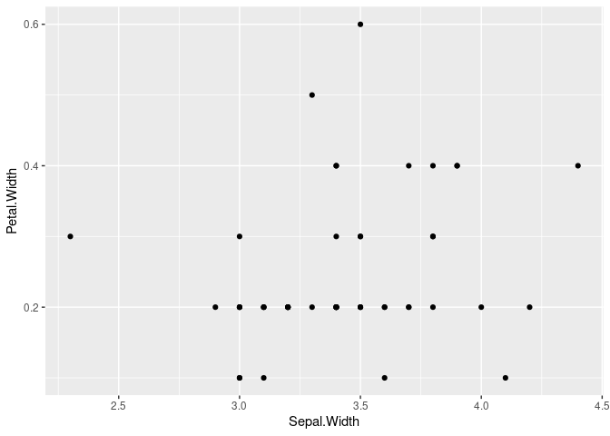

<!-- README.md is generated from README.Rmd. Please edit that file -->

# mon.super.package

<!-- badges: start -->

<!-- badges: end -->

The goal of mon.super.package is to …

## Installation

And the development version from [GitHub](https://github.com/) with:

``` r
# install.packages("devtools")
devtools::install_github("statnmap/mon.super.package")
```

## Reproducible example

This is a basic example which shows you how to solve a common problem:

``` r
library(mon.super.package)
## basic example code
# mon.super.package::run_app()
```

What is special about using `README.Rmd` instead of just `README.md`?
You can include R chunks like so:

``` r
mon_fichier <- system.file("example-data/iris_filtered.rds", package = "mon.super.package")
mon_iris <- readr::read_rds(mon_fichier)
mon_iris
#> # A tibble: 50 x 5
#>    Sepal.Length Sepal.Width Petal.Length Petal.Width Species
#>           <dbl>       <dbl>        <dbl>       <dbl> <chr>  
#>  1          5.1         3.5          1.4         0.2 setosa 
#>  2          4.9         3            1.4         0.2 setosa 
#>  3          4.7         3.2          1.3         0.2 setosa 
#>  4          4.6         3.1          1.5         0.2 setosa 
#>  5          5           3.6          1.4         0.2 setosa 
#>  6          5.4         3.9          1.7         0.4 setosa 
#>  7          4.6         3.4          1.4         0.3 setosa 
#>  8          5           3.4          1.5         0.2 setosa 
#>  9          4.4         2.9          1.4         0.2 setosa 
#> 10          4.9         3.1          1.5         0.1 setosa 
#> # … with 40 more rows

creer_graph(mon_iris)
```



You’ll still need to render `README.Rmd` regularly, to keep `README.md`
up-to-date.
